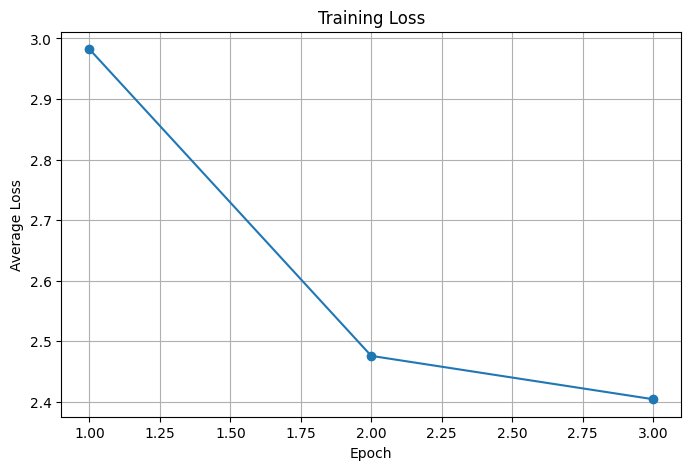
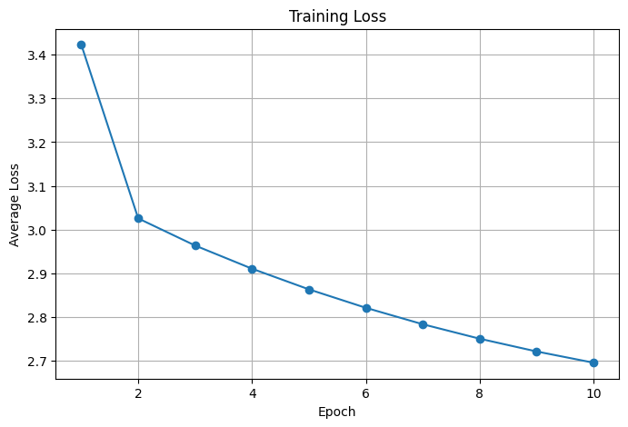

# word2vec-from-scratch-numpy

Pure NumPy implementation of Word2Vec using the Skip-Gram architecture with Negative Sampling.

## What is included

- text preprocessing and vocabulary building
- skip-gram pair generation
- negative sampling with the unigram^0.75 distribution
- manual forward pass, loss, gradients, and SGD updates
- nearest-neighbor inspection with cosine similarity
- training loss visualization

## Requirements

Install dependencies:

```bash
pip install -r requirements.txt
```

## Dataset

The training script expects the `text8` dataset at:

```text
data/text8
```

If the file is missing, download `text8` and place it in the `data/` directory.

## Run

From the repository root, run:

```bash
python -m scripts.run_training
```

To skip plotting:

```bash
python -m scripts.run_training --no-plot
```
## Tests

The project includes basic `pytest` coverage for the core Word2Vec pipeline:

- gradient checks for the Skip-Gram with Negative Sampling objective
- skip-gram pair generation and negative sampling utilities
- preprocessing and vocabulary building
- training-loop smoke tests

Run all tests from the repository root:

```bash
python -m pytest -q
```

Run a single test module:

```bash
python -m pytest tests/test_gradients.py -q
```

## Default configuration

The repository uses the following default values from `src/config.py`:

```python
EMBEDDING_DIM = 50
WINDOW_SIZE = 2
NUM_NEGATIVE_SAMPLES = 5
LEARNING_RATE = 0.025
EPOCHS = 3

MIN_COUNT = 5
MAX_VOCAB_SIZE = None
MAX_TOKENS = 100000

SEED = 42
```

These are the default values used when no command-line overrides are provided.

## Example

```bash
python -m scripts.run_training --max-tokens 100000 --epochs 3 --embedding-dim 50 --window-size 2 --num-negative-samples 5 --no-plot
```

## Experiment configuration

An additional training experiment was launched with the following configuration:

```python
EMBEDDING_DIM = 100
WINDOW_SIZE = 3
NUM_NEGATIVE_SAMPLES = 10
LEARNING_RATE = 0.025
EPOCHS = 10

MIN_COUNT = 5
MAX_VOCAB_SIZE = None
MAX_TOKENS = 200000

SEED = 42
```

## Results

### Experiment 1: default demo configuration

Configuration:

```python
EMBEDDING_DIM = 50
WINDOW_SIZE = 2
NUM_NEGATIVE_SAMPLES = 5
LEARNING_RATE = 0.025
EPOCHS = 3

MIN_COUNT = 5
MAX_VOCAB_SIZE = None
MAX_TOKENS = 100000

SEED = 42
```

Run statistics:

- Tokens after filtering: `84870`
- Vocabulary size: `2629`
- Training pairs: `339474`
- Final loss: `2.4043`

Loss history:



Nearest neighbors:

```text
king   -> colony (0.9702), policy (0.9693), round (0.9651), governor (0.9646), dollars (0.9627)
queen  -> band (0.9837), consisting (0.9766), coastal (0.9755), sterreich (0.9745), heart (0.9738)
man    -> told (0.9388), mother (0.9321), clear (0.9287), job (0.9272), worker (0.9249)
woman  -> musical (0.9754), score (0.9722), big (0.9710), brakeman (0.9693), ten (0.9671)
city   -> parliament (0.9597), treaty (0.9496), federal (0.9471), consists (0.9471), council (0.9461)
love   -> minerals (0.9846), accounts (0.9823), developments (0.9799), philadelphia (0.9796), kentucky (0.9794)
```
Comment:

The loss decreases clearly over 3 epochs, which confirms that the optimization loop is working correctly. However, the nearest neighbors are still fairly noisy and often not strongly semantic, which is expected for a short demo run on a limited subset of the corpus.

### Experiment 2: larger training configuration

Configuration:

```python
EMBEDDING_DIM = 100
WINDOW_SIZE = 3
NUM_NEGATIVE_SAMPLES = 10
LEARNING_RATE = 0.025
EPOCHS = 10

MIN_COUNT = 5
MAX_VOCAB_SIZE = None
MAX_TOKENS = 200000

SEED = 42
```

Run statistics:

- Tokens after filtering: `176569`
- Vocabulary size: `4533`
- Training pairs: `1059402`
- Final loss: `2.6953`

Loss history:



Nearest neighbors:

```text
king   -> priam (0.5910), daniel (0.5839), concerto (0.5776), secretary (0.5730), frederick (0.5607)
queen  -> reserve (0.6633), facto (0.6555), navy (0.6173), rush (0.6079), seat (0.5987)
man    -> dollar (0.5495), writes (0.5438), woman (0.5378), boyle (0.5078), mourned (0.4854)
woman  -> screenwriter (0.6440), bertram (0.6273), knowing (0.6082), scudder (0.5941), dollar (0.5926)
city   -> downtown (0.6107), port (0.5959), melbourne (0.5847), town (0.5829), arctic (0.5552)
love   -> fell (0.6739), instrument (0.6011), priam (0.5954), friend (0.5896), daughter (0.5725)
```
Comment:

The loss keeps decreasing steadily over 10 epochs, showing more consistent training on the larger setup. The learned neighborhoods are still imperfect, but some results become more meaningful, for example `city` -> `downtown`, `port`, `melbourne`, `town` and the relation between `man` and `woman`, which suggests that the embeddings are beginning to capture useful distributional structure.

## Project structure

- `src/preprocessing.py` - token loading and vocabulary creation
- `src/dataset.py` - skip-gram pairs and negative-sampling distribution
- `src/model.py` - Skip-Gram with Negative Sampling model
- `src/train.py` - training loop
- `src/evaluate.py` - nearest neighbors and loss plotting
- `scripts/run_training.py` - training entrypoint
